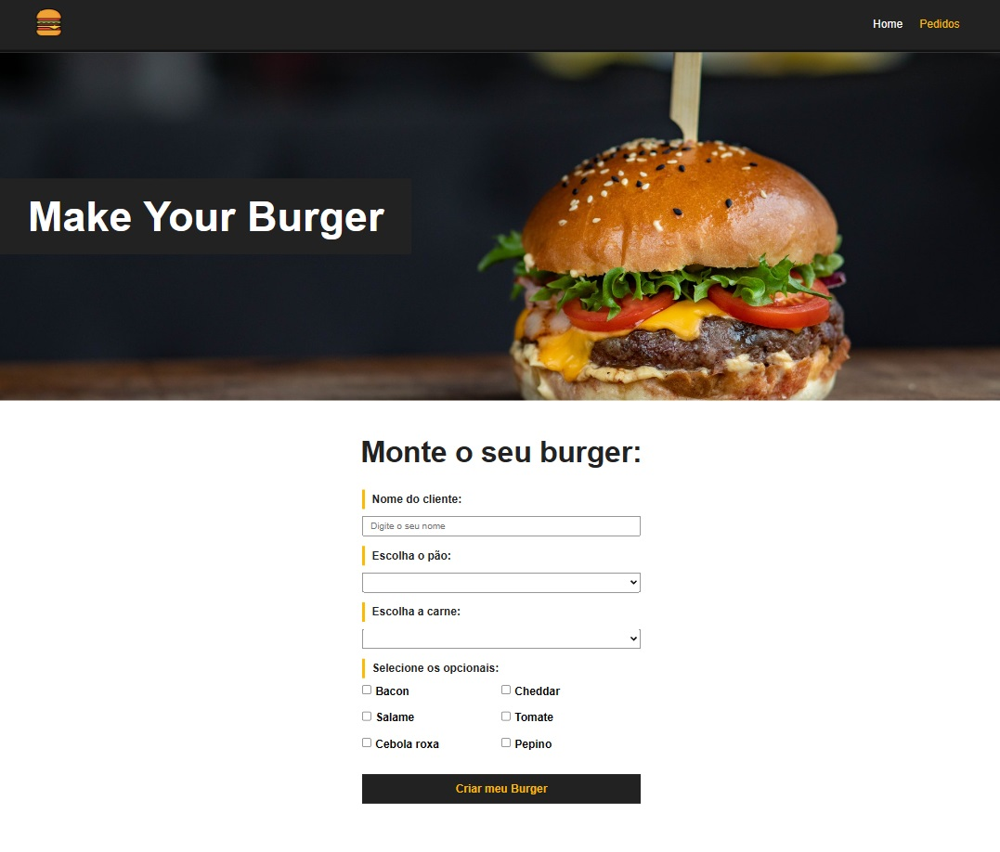
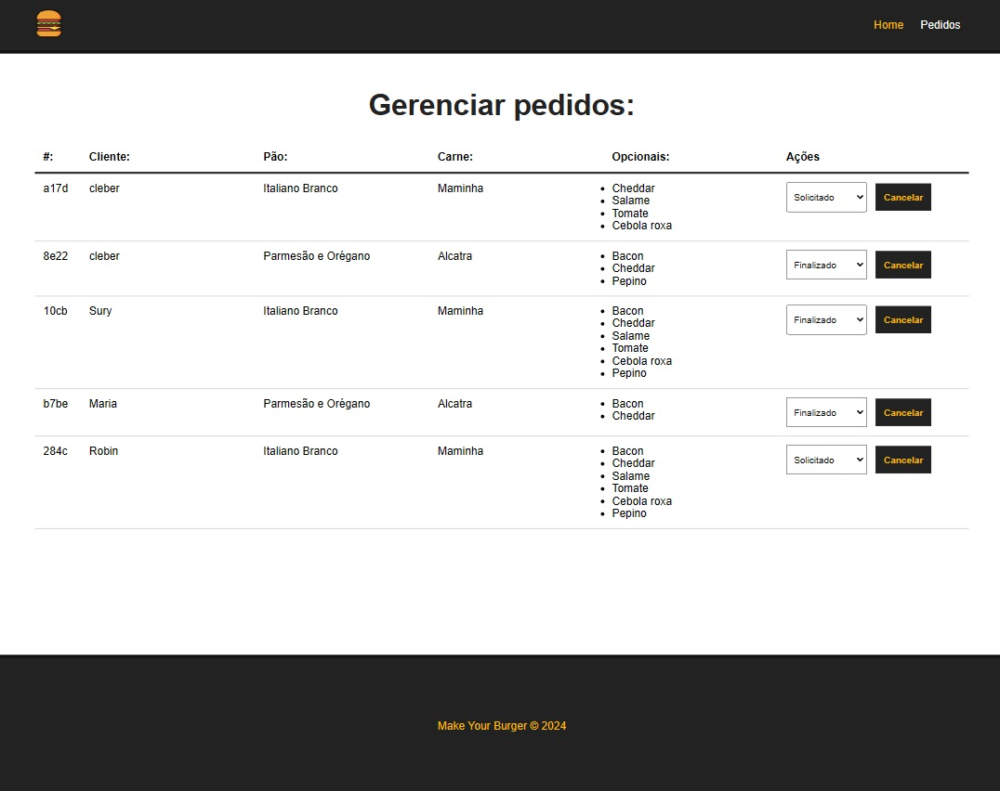

<h1 align="center">Make Your Burger</h1>

  

  

## 🚀 Tecnologias

Esse projeto foi desenvolvido com as seguintes tecnologias:

- HTML
- CSS
- JavaScript
- VueJS

## 💻 Projeto

Um app web de pedidos de um Hamburgueria feito com o intuito de praticar e estudar VueJS.

---

Feito com ♥ by Cleber-Risu
